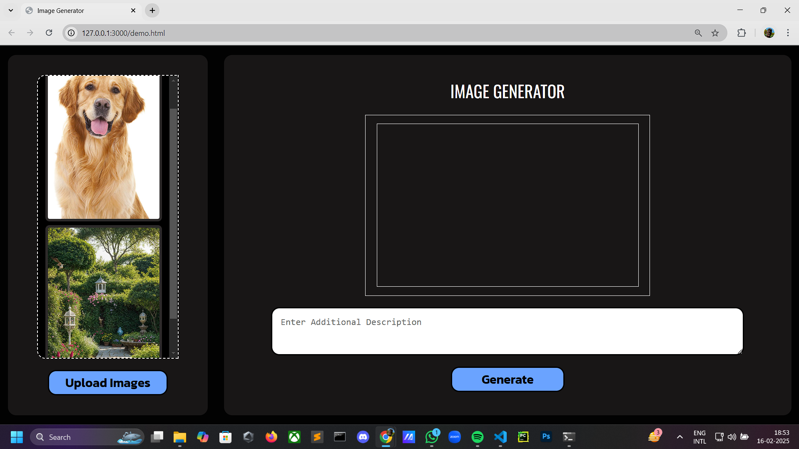
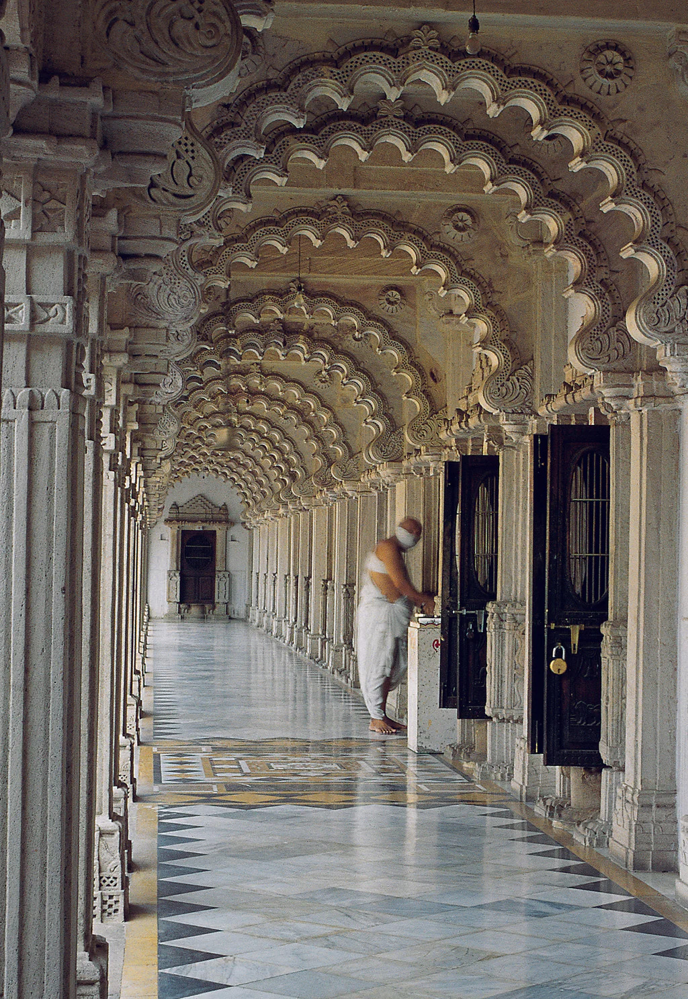
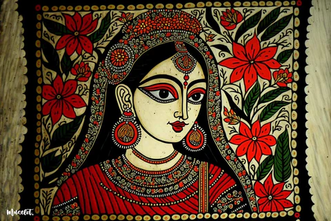
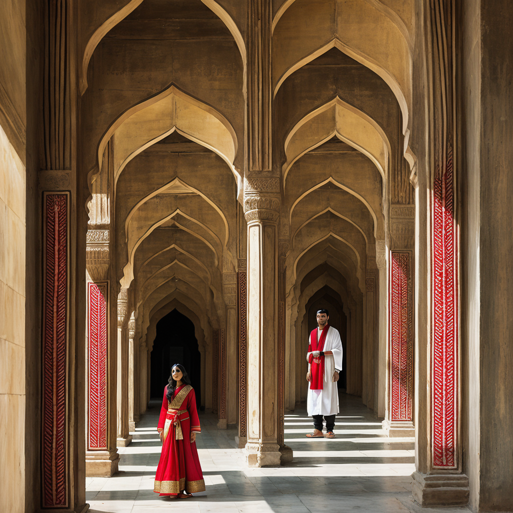
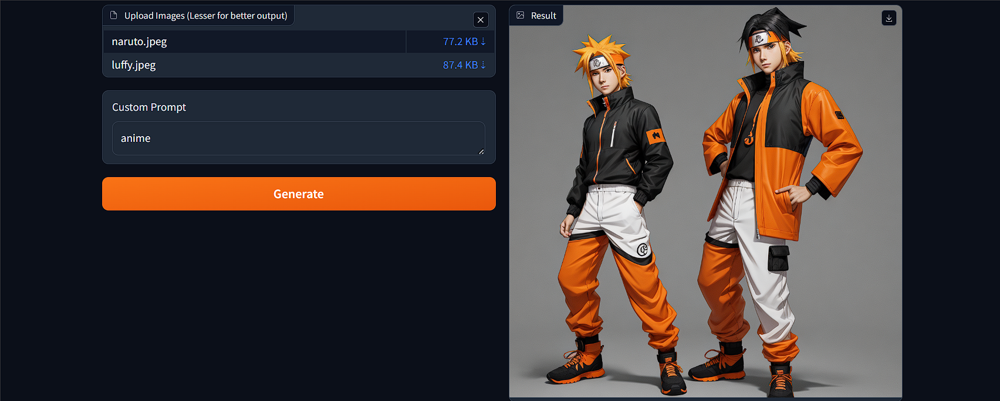

# Image Generator


An advanced AI image generation tool that combines multiple images to create stunning visual art from image inputs and text prompts. This project combines elements from input images and incorporates user-provided prompts to create cohesive, visually appealing outputs.We incorporate either Flask+Ngrok or Gradio for our backend, as it enables us to run the model either locally with a High-end GPU or through Gradio on a Google colab notebook. 

## Key Objectives

 - Combine elements from multiple input images into a single meaningful output.
 - Use user-provided prompts to guide the generation process and ensure relevance.
 - Retain critical details and visual features from input images while generating a cohesive output.
 - Enable applications in design, education, and content creation
## Features

- 🖼️ Image-to-Image Generation using Stable Diffusion
- 🔍 CLIP Interrogator for prompt engineering
- 🖥️ Custom Web Interface with dark theme
- 🚀 Flask/Gradio backend with Ngrok tunneling
- ⚡ GPU-accelerated inference
- 🔄 Multiple image blending capabilities
- 📋 Prompt optimization and summarization

## Tech Stack

**Frontend:**  


**Backend:**  


**AI Models:**  
- DreamShaper v8(from CivitAI)
- CLIP ViT-L/14
- T5-base Summarization

## 1. Using Flask/Ngrok locally(need at least 12GB VRAM GPU)
### Installations:
1. **Clone Repository**
```bash
git clone https://github.com/buggytanmoy77/Chaos.git
cd chaos-ai
```
2. **Install Dependencies**
```bash
pip install torch==2.5.1 torchvision==0.20.1 torchaudio==2.5.1 --index-url https://download.pytorch.org/whl/cu124
pip install -r requirements.txt
```
3. **Download Models**
```bash
wget https://civitai.com/api/download/models/128713 -O custom_model.safetensors
```
### Configuration:
1. **Ngrok Setup**
 - Get your auth token from [Ngrok Dashboard](https://dashboard.ngrok.com/) and update:
```python
ngrok.set_auth_token("YOUR_NGROK_AUTH_TOKEN")
```
2. **Environment Variables**
 Create `.env` file:
   ```env
   FLASK_ENV=development
   MODEL_PATH=custom_model.safetensors
   ```

### Usage

1. **Start the Application**
```bash
python app.py
```

2. **Access the Web Interface**  
   Use the Ngrok URL provided in the console output

3. **Generate Images**
   - Upload up to 5 reference images
   - Add optional text prompt
   - Click "Generate" and wait ~30 seconds
   - Download or share your generated image

### Project Structure

```
├── app.py              # Main application logic
├── templates/          # HTML templates
│   └── index.html
├── static/             # Static assets
│   ├── css/
│   └── js/
├── custom_model.safetensors  # Stable Diffusion model
└── requirements.txt    # Dependency list
```

### Screenshots

  
*Image generation interface with dark theme*

### If you want to just see the Frontend for this approach RUN DEMO.HTML

### Troubleshooting

**Common Issues:**
- CUDA Out of Memory: Reduce image size in `app.py`
- Dependency Conflicts: Use exact versions from `requirements.txt`
- Ngrok Connection Issues: Restart runtime and check auth token

**Performance Tips:**
- Enable xFormers for memory optimization
- Keep number of input images ≤3 for faster processing

### Contributing

Contributions are welcome! Please follow these steps:
1. Fork the repository
2. Create your feature branch (`git checkout -b feature/AmazingFeature`)
3. Commit your changes (`git commit -m 'Add some AmazingFeature'`)
4. Push to the branch (`git push origin feature/AmazingFeature`)
5. Open a Pull Request
   
## 2.Using Gradio( through Colab )

### Run on Google Colab

1. Clone the repository:
   ```bash
   git clone https://github.com/buggytanmoy77/Chaos.git
   cd chaos-ai
   ```
2. Open and run the Colab notebook - IMAGE_GENERATOR_USING_GRADIO_APPROACH.ipynb

### Manual Installation

1. Install dependencies:
   ```bash
   pip install -q diffusers transformers accelerate torch xformers gradio==3.50.2 pyngrok nest_asyncio clip-interrogator==0.6.0 safetensors huggingface_hub
   sudo apt-get install -y libgl1 libglib2.0-0
   ```
2. Download the model:
   ```bash
   wget https://civitai.com/api/download/models/128713 -O custom_model.safetensors
   ```
3. Run the application:
   ```bash
   python app.py
   ```

### How It Works

1. **Image Feature Extraction**: CLIP Interrogator analyzes input images and generates descriptive prompts.
2. **Prompt Summarization**: A T5 model condenses the extracted features into a refined Stable Diffusion prompt.
3. **Stable Diffusion Image Generation**: The optimized prompt is used to generate a high-resolution image.
4. **Caching Mechanism**: Previously generated results are cached to improve performance.

### UI Overview

The Gradio interface consists of:
- **File Upload:** Upload up to 5 images.
- **Custom Prompt Box:** Add extra descriptions to influence the final result.
- **Generate Button:** Starts the image generation process.
- **Output Display:** Shows the generated image and the refined prompt used.

### Running the Gradio Interface

The app runs a Gradio web UI using Ngrok for remote access. The interface can be launched with:
```python
demo.launch(server_name="0.0.0.0", server_port=7860, share=False, debug=True)
```

After launching, an Ngrok-generated URL is displayed for external access.

### Example Output

| Input Images | Generated Image |
|-------------|----------------|
|    |  |

### Screenshots

  
*Gradio image generation interface with dark theme*

## Future Improvements

- Support for additional image formats.
- Integration with larger summarization models.
- Enhanced UI/UX with more customization options.

## Contributing

Contributions are welcome! Feel free to fork this repository and submit a pull request.


## License

Distributed under the MIT License. See `LICENSE` for more information.

## Acknowledgments

- Stable Diffusion model by CompVis
- CLIP Interrogator implementation by pharmapsychotic
- CivitAI community for model hosting
- Hugging Face for transformer models

## Contact

Tanmoy Talukdar - [@buggytanmoy77](https://github.com/buggytanmoy77) - buggytanmoy@email.com<br />
Hrishikesh Nath - [@wardayX](https://github.com/wardayX) - nathh722@gmail.com<br />
Faruk Ahmed - [@Faruk0713](https://github.com/Faruk0713) - fa0713026@gmail.com

Project Link: [https://github.com/buggytanmoy77/Chaos-AI-Generator](https://github.com/buggytanmoy77/Chaos-AI-Generator)
